<h1 align="center">
	Spin
</h1>

<h4 align="center">Project scaffolding tool and set of templates for Reason and OCaml.</h4>

<p align="center">
  <a href="https://github.com/tmattio/spin/actions">
    
  </a>
  <a href="https://badge.fury.io/js/%40tmattio%2Fspin">
    
  </a>
</p>

<p align="center">
  <a href="#features">Features</a> •
  <a href="#installation">Installation</a> •
  <a href="#templates">Templates</a> •
  <a href="#usage">Usage</a> •
  <a href="#contributing">Contributing</a> •
  <a href="#roadmap">Roadmap</a>
</p>

<div align="center">
  
</div>

## Features

🚀 Quickly start new projects that are ready for the real world.

❤️ Have a great developer experience when developping with Reason/OCaml.

🏄 Be as productive as Ruby-on-Rails or Elixir's Mix users.

🔌 Establish a convention for projects organizations to make it easy to get into new projects.

## Installation

### Using Homebrew (macOS)

```bash
brew install https://raw.githubusercontent.com/tmattio/spin/master/scripts/spin.rb
```

<!-- ### Using Chocolatey (Windows)

```bash
choco install
``` -->

### Using npm

```bash
yarn global add @tmattio/spin
# Or
npm -g install @tmattio/spin
```

### Using a script

```bash
curl -fsSL https://github.com/tmattio/spin/raw/master/dist/install.sh | bash
```

## Templates

You can generate a new project using a template with `spin new`. For instance:

```bash
spin new native my_app
```

Will create a new native application in the directory `./my_app/`

Anyone can create new Spin templates, but we provide official templates for a lot of use cases. The official templates for each type of applications are listed below.

### Templates for native applications

- **[native](https://github.com/tmattio/spin-templates/tree/master/native)** - A native project containing the minimum viable configurations.
- **[cli](https://github.com/tmattio/spin-templates/tree/master/cli)** - Native command line interface.

### Templates for web applications

- **[react](https://github.com/tmattio/spin-templates/tree/master/react)** - React Single-Page-Application in Reason.

### Templates for hybrid applications

- **[lib](https://github.com/tmattio/spin-templates/tree/master/lib)** - A library to be used in native or web applications.
- **[ppx](https://github.com/tmattio/spin-templates/tree/master/ppx)** - A PPX library to be used in native or web applications.

## Usage

### `spin new TEMPLATE [PATH]`

Create a new ReasonML/Ocaml project from a template.

`PATH` defaults to the current working directory.

### `spin ls`

List the official Spin templates.

### `spin gen`

List the generators available for the current project.

### `spin gen GENERATOR`

Generate a new component in the current project.

## Contributing

We would love your help improving Spin!

### Developing

You need Esy, you can install the latest version from [npm](https://npmjs.com):

```bash
yarn global add esy@latest
# Or
npm install -g esy@latest
```

> NOTE: Make sure `esy --version` returns at least `0.5.8` for this project to build.

Then run the `esy` command from this project root to install and build depenencies.

```bash
esy
```

Now you can run your editor within the environment (which also includes merlin):

```bash
esy $EDITOR
esy vim
```

Alternatively you can try [vim-reasonml](https://github.com/jordwalke/vim-reasonml)
which loads esy project environments automatically.

After you make some changes to source code, you can re-run project's build
again with the same simple `esy` command.

```bash
esy
```

This project uses [Dune](https://dune.build/) as a build system, and Pesy to generate Dune's configuration files. If you change the `buildDirs` configuration in `package.json`, you will have to regenerate the configuration files using:

```bash
esy pesy
```

### Running Binary

After building the project, you can run the main binary that is produced.

```bash
esy start
```

### Running Tests

You can test compiled executable (runs `scripts.tests` specified in `package.json`):

```bash
esy test
```

### Building documentation

Documentation for the libraries in the project can be generated with:

```bash
esy doc
open-cli $(esy doc-path)
```

This assumes you have a command like [open-cli](https://github.com/sindresorhus/open-cli) installed on your system.

> NOTE: On macOS, you can use the system command `open`, for instance `open $(esy doc-path)`

### Creating release builds

`esy` allows creating prebuilt binary packages for your current platform, with no dependencies:

```bash
esy release
```

This creates a directory `_release` containing a ready-to-publish npm package. You can go to this directory and execute `npm publish`:

```bash
cd _release
npm publish
```

### Repository Structure

The following snippet describes Spin's repository structure.

```text
.
├── .github/
|   Contains Github specific files such as actions definitions and issue templates.
│
├── docs/
|   End-user documentation in Markdown format.
│
├── bin/
|   Source for Spin's binary. This links to the library defined in `lib/`.
│
├── lib/
|   Source for Spin's library. Contains Spin's core functionnalities.
│
├── test/
|   Unit tests and integration tests for Spin.
│
├── test_runner/
|   Source for the test runner's binary.
|
├── dune-project
|   Dune file used to mark the root of the project and define project-wide parameters.
|   For the documentation of the syntax, see https://dune.readthedocs.io/en/stable/dune-files.html#dune-project
│
├── LICENSE
│
├── package.json
|   Esy package definition.
|   To know more about creating Esy packages, see https://esy.sh/docs/en/configuration.html.
│
├── README.md
│
└── spin.opam
    Opam package definition.
    To know more about creating and publishing opam packages, see https://opam.ocaml.org/doc/Packaging.html.
```

## Roadmap

- Add more templates
  - **data-science** - Data Science workflow.
  - **desktop** - Native UI application using Revery.
  - **graphl-api** - HTTP server that serves a GraphQL API.
  - **rest-api** - HTTP server that serves a REST API.
  - **react-components** - React component library with Storybook.
  - **bs-bindings** - Bucklescript bindings to Javascript libraries.
- Create infrastructure of generated projects (i.e. generate terraform code)
- Write tutorials for the templates (e.g. Add user authentication for graphql-api)
